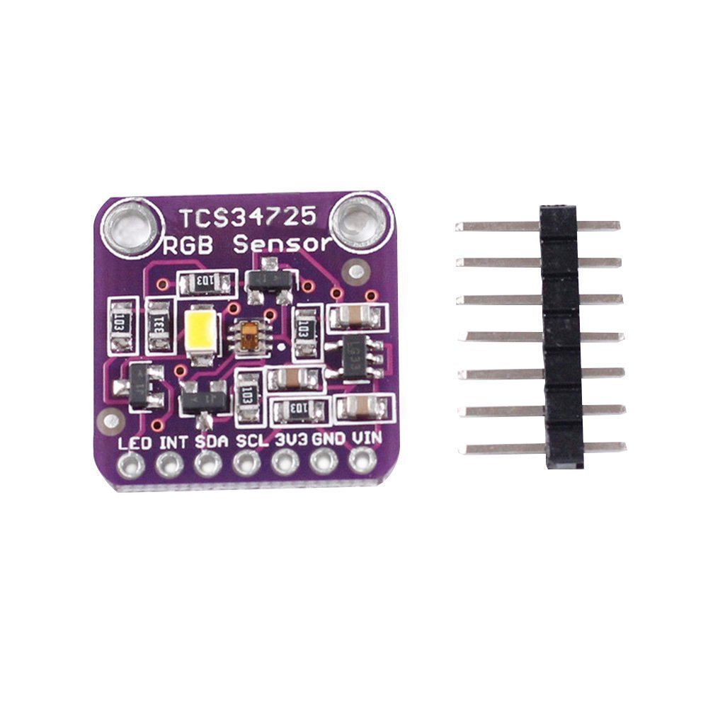
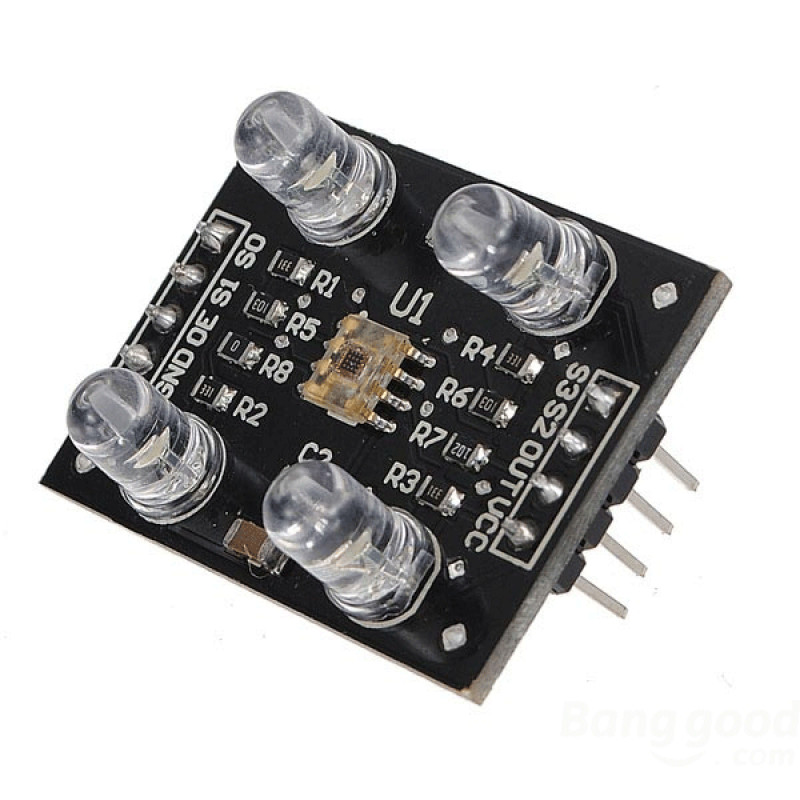

___
**GitHub repository for WRO INDIA Nationals Team TVIS-Pi0neers Future Engineers 2024. It contains our work on building a robot for self-assisted track navigation.**

Below is the documentation of the self-autonomous driving car
___
# Contents
- [Hardware Sketch](#hardware)
  - [Parts Used](#parts-used)
  - [Building and Schematic Diagram](#building-and-schematic-diagram)
  - [Photos](#photos)
- [Software Sketch](#software)
  - [Programming Language](#programming-language)
  - [Open Challenge](#open-challenge)
     - [Ultrasonic Sensor](#ultrasonic-sensor)
     - [Gyro Sensor](gyro-sensor)
     - [Color Sensor](color-sensor)
  - [Obstacle Challenge](obstacle-challenge)
    - [Improving processes of image processing and predictions through the camera](improving-processes-of-image-processing-and-predictions-through-the-camera)
       - [Sensor](sensor)
       - [Sensor](sensor)
       - [Sensor](sensor)
- [Our Team](our-team)
- [Our Approach](our-approach)
- [Problems we encountered on the way](problems-we-encountered-on-the-way)
- [Demonstration Videos](demonstration-videos)
 ___
 # Hardware
 ## Parts Used
- RC Offroad Car Chassis 
- Arduino Nano
- Three Ultrasonic Sensors HC-SRO4 
- L298N Motor Driver Module
- 2200 mh battery LIPO
- LM2596 Step Down DC-DC Buck Converter Adjustable Module
- Color sensor
- Gyro sensor
# Building and Schematic Diagram
## Photos
| Left-aligned | Center-aligned |
|:-------------|:--------------:|
| Row 1, Col 1 | Row 1, Col 2   | 
| Row 2, Col 1 | Row 2, Col 2   | 
# Software 
## Programming Language 
## Open Challenge
### Ultrasonic Sensor
### Gyro Sensor
### Color Sensor
## Obstacle Challenge 
### Improving image processing and predictions through the camera.
#### Sensor
#### Sensor
# Our Team
# Our Approach
We first tried approaching the open challenge by making a simple maze solver with three ultrasonic sensors. However, we quickly realized that the algorithm involved too much static and backward motion.

So we approached it differently by integrating the Ultrasonic Sensor with the Color sensor and Gyro Sensor.
# Problem encountered on the way
For the color sensor, we first decided to use the TCS-34725

The sensor was very inaccurate during fast-paced movement, so we decided to use the TCS-270 which was a great substitute for the TCS-34725

# Demonstration Video

